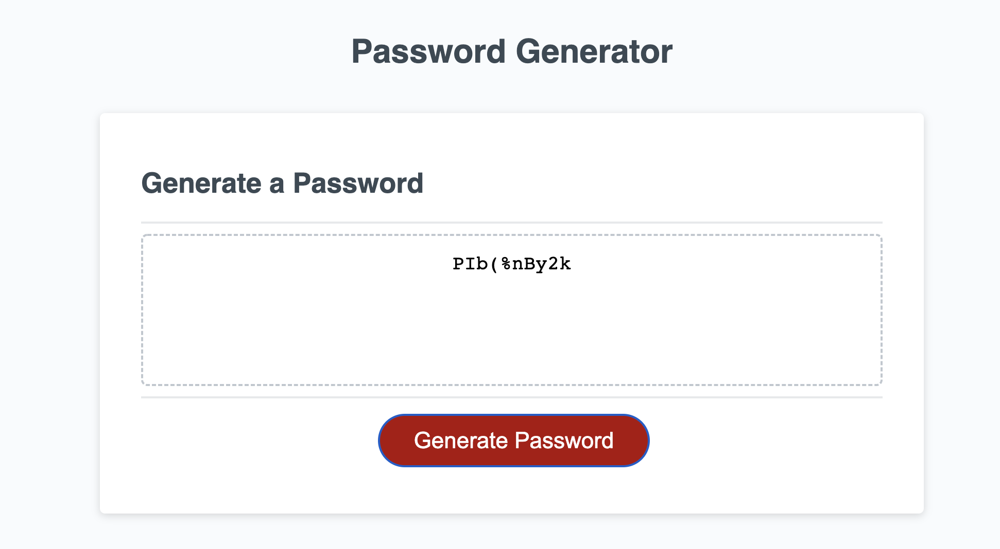
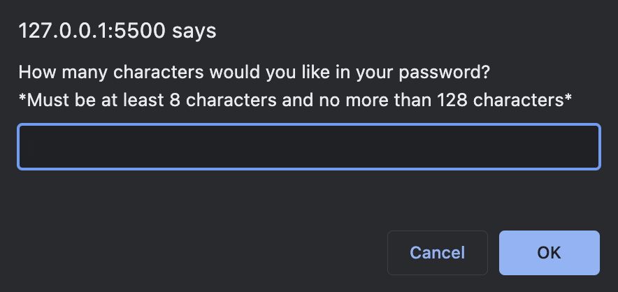
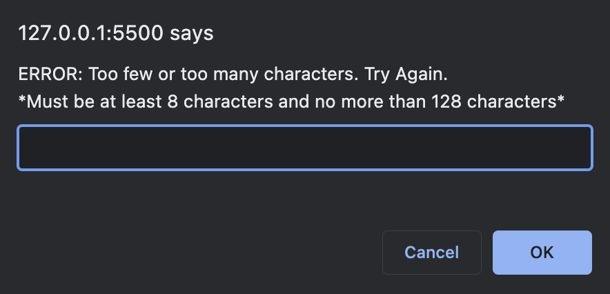
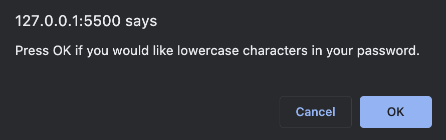
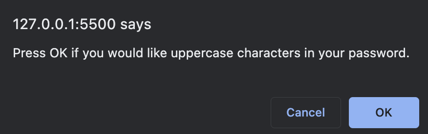
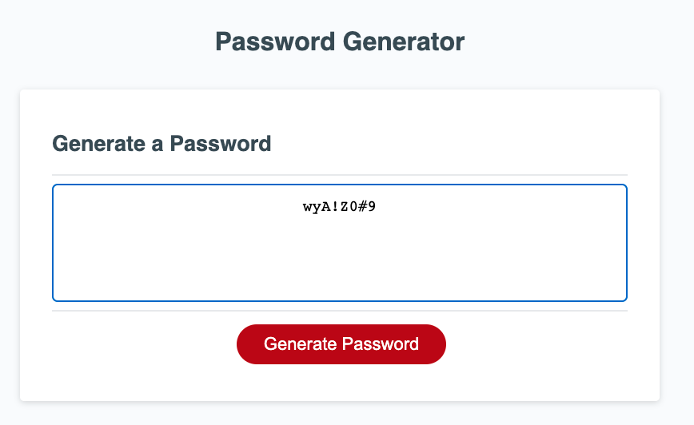

# Challenge Three: Javascript Password Generator

## Project Description

Challenge three required us to modify the starter code so that the application functions correctly. This application functions correctly if the user is given a password with the length and criteria that they chose. The application must require the user to choose a password length at least 8 characters and no more than 128. The user then selects whether they'd like lowercase, upper, numeric, and special characters. 

### Application Screenshot

The following images shows the password generator:

### Password Length Prompts  

The following images show the prompts asking the user for their password's length and alerts the user if the length is too short or too long. 

### Criteria Prompts  

The application asks four prompts: include lowercase, include uppercase, include numeric, and include special characters. The following images shows two of the four prompts asked by the application. 

### Criteria Character(s) Guaranteed

The password generated ensures at least one character from each criteria you've selected.

### Link to Github Page
[https://jffsun.github.io/chall-three-password-generator/](https://jffsun.github.io/chall-three-password-generator/).

### Link to Github Respository
[https://github.com/jffsun/chall-three-password-generator](https://github.com/jffsun/chall-three-password-generator).